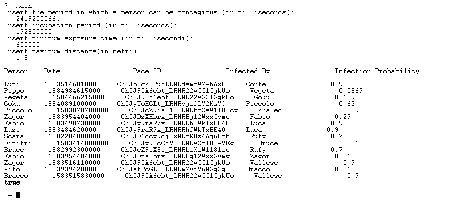

# Prolog-Covid19-Tracker

This project concerns the work I did for the final exam of the university subject "Artificial Intelligence". I worked on this project at the beginning of the Covid-19 pandemic, during the period of the first lockdown.

# Project Description

The project consists in the implementation of an algorithm to track the contacts of a person who tested positive for Covid-19, using the programming language prolog.
The algorithm used is based on geolocation data obtained from mobile devices, in particular data extracted from the Google Location History.

To test the algorithm i created a fictional database of prolog facts:

```prolog
a('Name', Start_time, Latitude, Longitude, End_Time, 'Place_ID')
```

For details look at <a href="Documentation/DatabaseProlog.pdf"> Database_Prolog.pdf </a>

Code analysis is reported in the file: <a href="Code_analysis.md"> Code_analysis.md</a>

# Requirements

<a href="https://www.swi-prolog.org/download/stable" >SWI Prolog</a>

# Run

- Download Repository

- Open SWI Prolog terminal

- Change working directory:

  ```prolog
  ?- working_directory(CWD,'enter directory path').

  ```

- Compile and run program
  ```prolog
  ?- ['Covid19_Tracker.pl']
  true.
  ```
- start:
  ```prolog
  ?- main.
  ```


